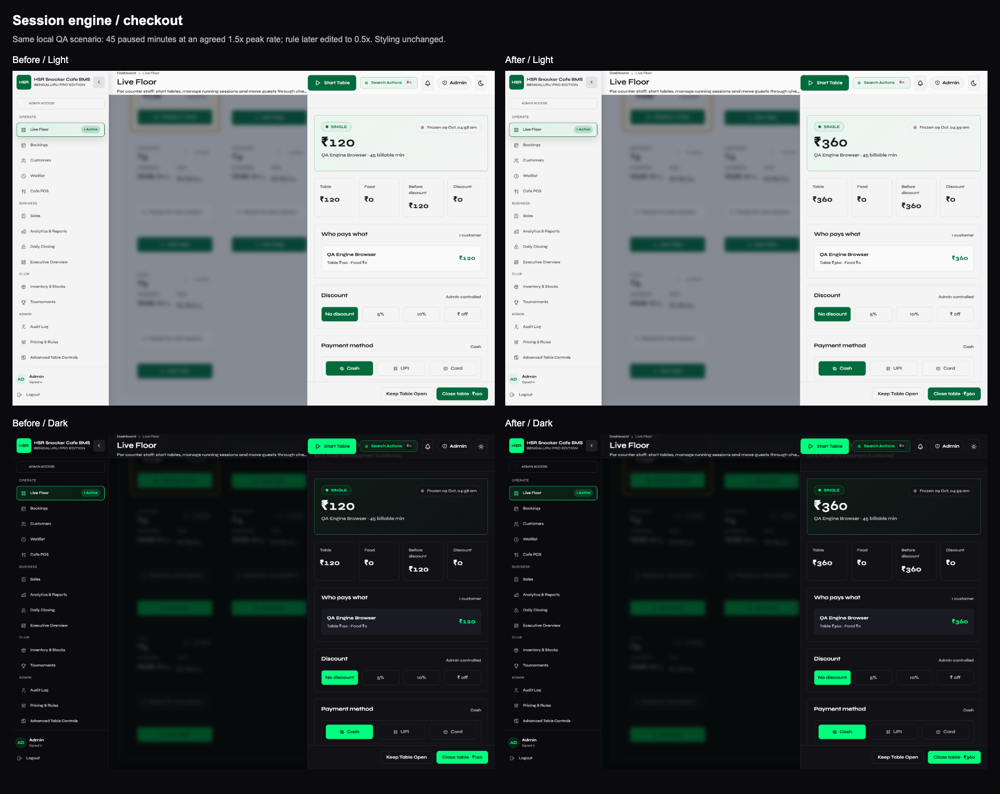

# Session-engine foundation evidence

This batch changes backend timing and pricing only. No frontend application,
font, color, CSS or layout file changed. The [approved scope](../FUNCTIONAL_ROADMAP.md)
excludes features 3, 6, 7 and 10 from the new build.

| Check | Before | After |
| --- | --- | --- |
| Pause/resume original start | Reported start shifts by the break duration | Original start remains immutable |
| Edit peak rule after starting a session | Agreed 45-minute play charge changes from INR 360 to INR 120 | Remains INR 360 in live state, quote and checkout |
| Paused checkout with future client timestamp | Records a future end | Clamped to server time |
| Existing open sessions | Dynamic peak-rate policy | Preserved until those legacy sessions close |
| Checkout retry/stale request | Existing single-transaction/stale-key checks | Still covered and passing |

## Compatibility

- Five nullable columns are added to `active_sessions`: `started_at`,
  `paused_at`, `total_paused_ms`, `rate_multiplier`, `rate_label`.
- New sessions snapshot peak multiplier/label at start. Existing rows keep
  NULL snapshots and their existing pricing policy; historical bills are untouched.
- `start_time` stays the compatible effective timer origin used by existing
  clients. `started_at` is the immutable original timestamp for quotes,
  receipts and frame archives. Completed break durations accumulate separately.
- Legacy original starts are recovered from the session-start audit payload
  when available. Without that evidence, retain the existing timestamp rather
  than invent history. Transfer pricing behavior is otherwise unchanged.
- Schema inspection and alterations share one connection/transaction. The
  focused suite removes the new columns, reruns the upgrade twice, and checks
  that legacy rows survive; CI repeats this against PostgreSQL.
- `/health` now exposes only the public commit SHA from
  [Render's documented `RENDER_GIT_COMMIT`](https://render.com/docs/environment-variables#render_git_commit).
  This lets release verification distinguish a running old instance from a
  successful rollout. `/ready` continues to check the database.

## Verification

- Baseline focused suite: 10 tests, 7 failing assertions reproducing the above
  gaps; checkout retries, session food and legacy pricing already passed.
- Final focused suite: 15 tests, including repeated breaks, transfers, frame
  identity, split payments, schema upgrade and release metadata.
- SQLite full soak: 87 requests, 1 cycle, PASS, 0 active sessions left.
- PostgreSQL parity workflow must pass before merge: fresh requirements
  installation, app import, all focused tests, then a full soak cycle.
- Browser checks use only the disposable `/tmp/hsr-session-browser.db`.
  Pause/Resume are clicked, checkout is opened in both themes, and QA records
  are cleaned. No production account, session, transaction or rate is mutated.
- With the pause request deliberately delayed 350ms, the existing disabled
  "Working..." state appears 7.3ms after pointer press. Completion takes 926ms
  including automation and the injected delay; it is not a silent wait.
- Raw [before measurements](before/measurements.json) and
  [after measurements](after/measurements.json) include theme tokens and timing.

[Live Floor before/after, light/dark](floor-before-after.png)
