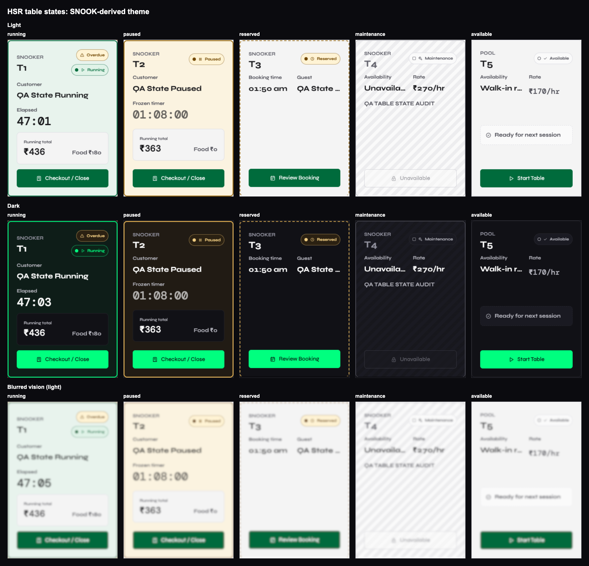

# Table states and SNOOK theme: visual evidence

Before is the unchanged deployed `main` build at `d5fe8d6`. After is the
SNOOK-derived theme with shared table-state cards. Both use the same local
QA fixture: running, paused, reserved, maintenance and available. No
production records were created or changed.

| Page | Fault | Rule | Fix applied | Before/after |
| --- | --- | --- | --- | --- |
| Live Floor | States depended mostly on a small badge | Figure/ground; redundant cues | Running tint + 2px border, large timer; dashed reservation; hatched maintenance; consistent bottom actions | [Light + dark](live-floor-before-after.png) |
| Dashboard floor strip | Idle/reserved/maintenance all read as ready | Same status source everywhere | Shared state config, names/times, state-specific actions carrying table identity | [Light + dark](dashboard-before-after.png) |
| Advanced controls | Local status styles and a separate illustrated detail card | One source of truth; primary separated from reset | Shared badges/borders, neutral detail summary, checkout loading state, 44px targets | [Light + dark](advanced-controls-before-after.png) |
| Reservations | Booking cards did not show current floor state | Operational status visible at a glance | Shared state, frozen/elapsed timer, player/amount and booking review | [Light + dark](reservations-before-after.png) |
| Tournament Hub | Status cards had independent presentation | Same state grammar | Shared labels/icons/borders/actions with table-specific routing | [Light + dark](tournament-before-after.png) |

## Acceptance evidence

- `npm run scan:contrast`: 16 routes, both themes, default and opened dynamic
  states; **0 violations**. Full output: [contrast scan](acceptance/contrast.json).
- Theme-token guard, lint, production-configured build and Python syntax: pass.
- 30 responsive checks: five affected screens, light/dark, 1440/375/414px;
  no horizontal overflow or topbar overlap, primary targets at least 44px.
- 20 table-action checks: visible press feedback in **19–72ms**; resulting
  dialog/navigation in **9–110ms**. This is not the deferred whole-app button audit.
- Syne and DM Mono are loaded locally, not just present in font-family strings.
  Dashboard's primary value is 28px/500 versus a 10px label: **2.8x**.
- Local fixture cleanup removes only its QA rows and refuses to overwrite
  non-QA sessions. Production was not seeded.

## Vision classification

Two running / three available tables; actual Chrome CDP vision emulation.
Fixed pixel classifier measures absolute luminance difference between the
second border pixel and an interior strip, excluding rounded corners/actions.
Threshold: **20 on the 0–255 scale**, held constant across both themes and all
five modes. An initial threshold of 6 misclassified blurred dark idle borders;
the revised threshold clears that measured noise. This is a deterministic
fixture regression check, not proof of human recognition or a trained model.

| Mode | Light running / idle border signal | Dark running / idle border signal | Classification |
| --- | --- | --- | --- |
| None | 159.370 / 0 | 166.095 / 0 | 5/5 each theme |
| Blurred vision | 40.999 / 3.928 | 107.006 / 8.783 | 5/5 each theme |
| Achromatopsia | 147.000 / 0 | 196.000 / 0 | 5/5 each theme |
| Deuteranopia | 150.457 / 0 | 188.770 / 0 | 5/5 each theme |
| Protanopia | 144.898 / 0 | 201.519 / 0 | 5/5 each theme |

Raw per-card luminance and edge-density results: [measurements](acceptance/measurements.json).
Browser fonts, mobile bounds and action timings: [theme measurements](acceptance/theme-interaction-measurements.json).
Live source: [SNOOK modes screenshot](reference/snook-modes.png); [exact token spec](../SNOOK_THEME.md).

Phase 2 whole-app UX and SSE work remain paused until the user's visual sign-off.
