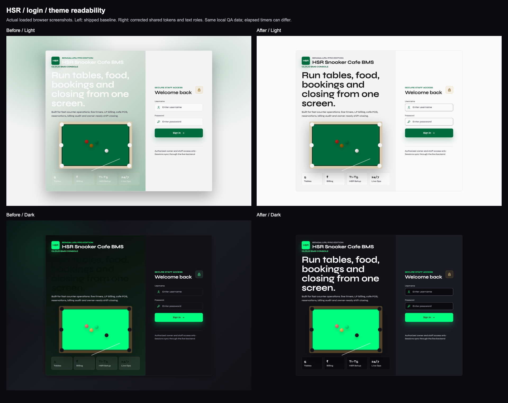
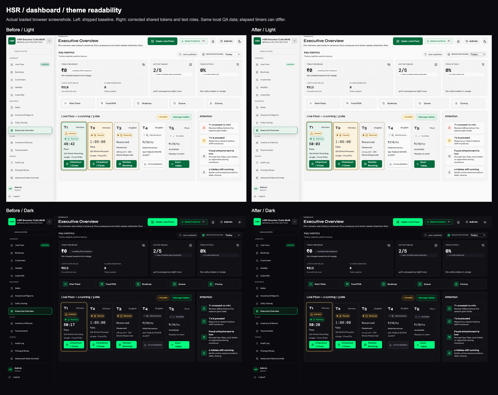
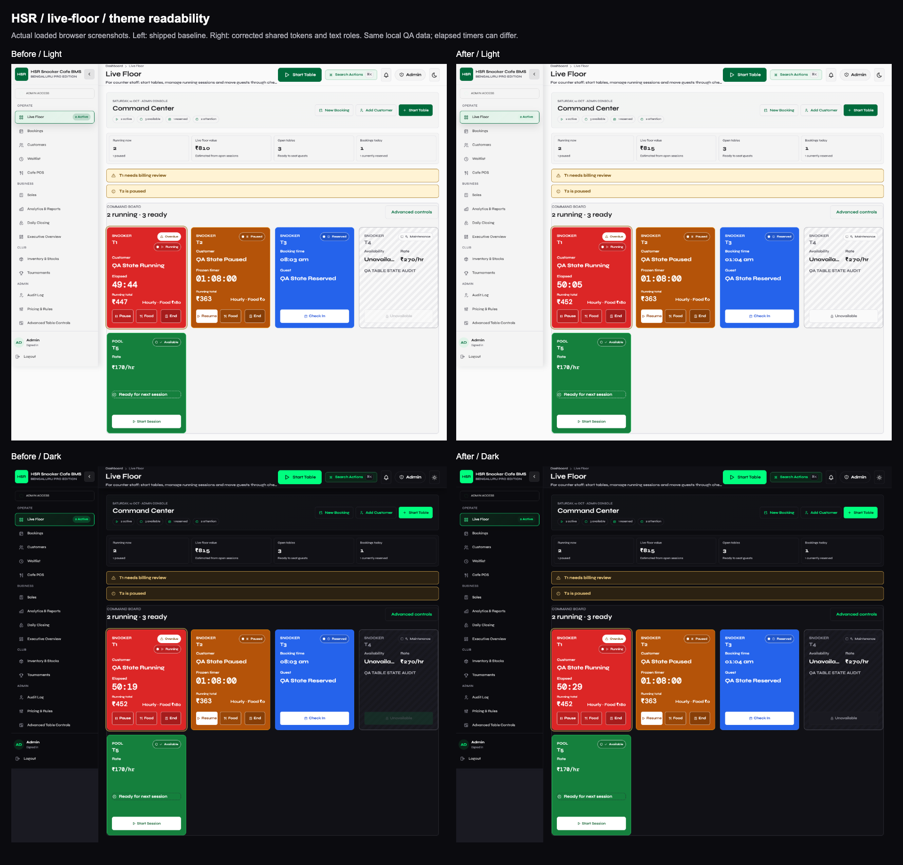

# Theme and Typography Contrast Fix

## Diagnosis

The semantic palette existed, but its ownership was fragmented across eleven
legacy theme blocks in `style.css` plus `design-tokens.css`. Several aliases
resolved on a different element from their theme override. Login headings and
footer figures used `--text-on-accent` on neutral surfaces: nearly white on pale
surfaces in light mode, dark brand ink on dark surfaces in dark mode. Translucent
white footer labels and faded billing-mode hints compounded the problem.

Startup applied `body.dark` only after the React module loaded. The Topbar owned
another independent theme state, outside login. The old contrast scanner excluded
login, field values, placeholders and translucent text, and could accept loading
skeletons as page evidence.

## Shared Fix

- All global palette/type/compatibility tokens now live in `design-tokens.css`.
  No page-local light/dark token blocks remain in `style.css`.
- Parser-time bootstrap sets `html.dark`, color scheme and initial canvas/text
  before the app loads. `localStorage.theme` is canonical; old `darkMode` values
  remain compatible. System preference is used when neither is valid. Storage
  denial does not break theme bootstrap. The same runtime synchronizes body for
  legacy selectors, Topbar, navigation and other tabs.
- Tailwind v4 semantic utilities use `@theme inline`; no v3 config or component
  `dark:` utility patches. The component guard finds no fixed color utilities.
- Neutral text uses primary/secondary/muted roles. Actions and statuses use
  paired foreground/background roles. Removed conflicting legacy login overrides
  and dark control overrides instead of adding another patch cascade.
- Input boundaries: light `#858590`, dark `#6C6C78`; existing canvas/card/action
  colors and Syne Variable / DM Mono remain unchanged. Disabled controls use
  readable muted text instead of whole-control opacity. Billing-mode hints no
  longer reduce text contrast with opacity.
- Booking modal now exposes dialog semantics, so foreground contrast is tested
  independently of its intentionally dimmed background page.

## Measured Evidence

`before/measurements.json` is the untouched shipped frontend served separately
on port 5177, with the same disposable QA data as the updated app on 5175.
Earlier setup captures of loading pages were discarded; the retained baseline
waits for loaded data and contains 32 failing samples across default/login-error
states. Final loaded-page and overlay scans both report **0 violations and
0 errors**, recorded in `after/measurements.json` and `contrast.json`.

| Pair | Light | Dark |
| --- | ---: | ---: |
| Primary text / canvas | 16.97:1 | 18.82:1 |
| Primary text / card | 16.11:1 | 18.03:1 |
| Secondary text / card | 7.03:1 | 9.15:1 |
| Muted text / card | 5.48:1 | 6.13:1 |
| Placeholder / input | 5.78:1 | 6.39:1 |
| Text / primary action | 6.35:1 | 14.17:1 |
| Error pair | 8.03:1 | 9.80:1 |
| Success pair | 5.73:1 | 12.06:1 |
| Warning pair | 7.42:1 | 10.48:1 |
| Input border / input | 3.50:1 | 3.79:1 |

Login's main heading previously measured approximately 1.17:1 in light and
1.01:1 in dark. Its corrected neutral pair is 16.11:1 / 18.03:1.

## Coverage And Reproduction

- 17 routes in light and dark, including anonymous login, plus login error/filled
  fields, notifications, command palette and first safe action. The scanner
  composites alpha/background layers, checks SVG text paint and samples actual
  rendered backgrounds for gradients/images (three positions per text line).
  A visible modal limits the check to foreground dialog content, not the dimmed
  page behind it. This is sampled visual evidence, not a proof of every possible
  future data value or modal combination.
- Correct large-text threshold: 24 CSS px, or 18.66 CSS px at weight 700+;
  ordinary text and placeholders require 4.5:1. Disabled controls are WCAG-exempt
  in the page scan, but their semantic text/background pair is tested separately.
- `runtime.json`: seven pre-app bootstrap cases, toggle/reload/navigation,
  cross-tab synchronization, eleven token pairs in each theme, mobile login and
  Live Floor at 375/414px, preserved table colors and no page errors.
- `actions/measurements.json`: eight session-action checks, actual pause/resume,
  forced-failure recovery, food, checkout/receipt, reserved check-in and frame
  guard; both themes and 44px unobscured mobile targets. Recorded feedback was
  4.7-13.8ms with a 350ms injected request delay. Foreground screenshots also pass
  the upgraded contrast check. Transient test timing failures were rerun; the
  retained successful run has no errors.

Use an isolated backend with `DATABASE_URL=sqlite:////tmp/hsr-tariff-browser.db`
and `ALLOWED_ORIGINS=http://127.0.0.1:5175,http://127.0.0.1:5177`. Start the QA
frontend on 5175 with `VITE_API_URL=http://127.0.0.1:8002`. Seed five local states
using `table-state-fixture.py` through an explicitly scoped disposable connection,
never its default developer database path. All QA mutations stay local.

From `frontend/`:

```sh
npm run lint
npm run check:theme
CONTRAST_APP_URL=http://127.0.0.1:5175 CONTRAST_API_URL=http://127.0.0.1:8002 npm run scan:contrast
npm run test:theme-runtime
node scripts/verify-theme-visibility.mjs
INLINE_AUDIT_DIR=../docs/theme-contrast-audit/actions node scripts/verify-inline-table-actions.mjs
node scripts/compose-theme-evidence.mjs
VITE_API_URL=https://hsr-bms-backend.onrender.com npm run build
```

## Screenshots

Left is before; right is after. First row light, second row dark. Individual
full-size screenshots for every route are in `before/` and `after/`.







## Deployment

Shipped on main as `1fc9d7de4b045ad3ddb007b49ade4b00e1e3c871`.
Production verification at `2026-10-10T17:42:17.360Z` confirmed entry
`/assets/index-HoaDSX9B.js` and byte-identical hashes for all 33 JS/CSS/font
assets. The early bootstrap is present in live HTML. `production-browser.json`
and the two `production-login-*.png` images confirm actual deployed light/dark
colors and Syne. Backend `/health` and `/ready` pass; its earlier revision is
an ancestor with identical backend code, as expected for a frontend-only fix.
No production mutation was performed. `cleanup.json` confirms zero local QA
sessions, frames, transactions, menu items, bookings and maintenance records.
The developer database was not touched, and temporary QA servers were stopped.

Production proof is recorded in `production.json`. The reusable
`verify-production-assets.mjs` checks every JS/CSS/font asset against the
production-shaped local build, confirms the early bootstrap in live HTML,
checks release ancestry on `origin/main`, and verifies backend health/readiness
plus unchanged backend code. No production account/data mutation is involved.
